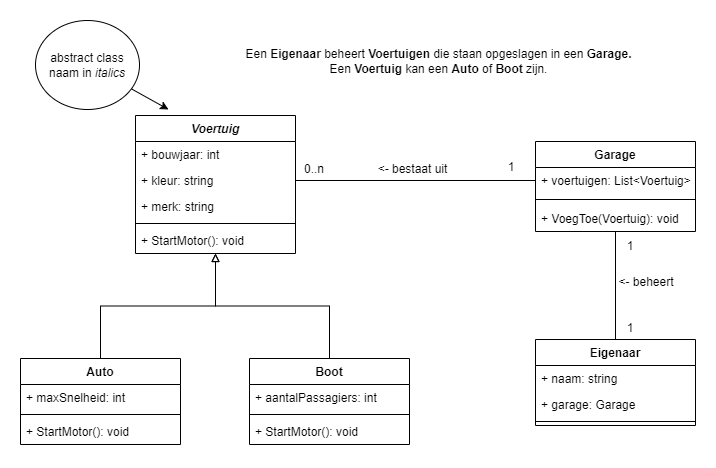

# OOP voorbeelduitwerking B1C2 - Intro to Development
Een voorbeeld uitwerking van Object Orientatie waarin vooral belicht wordt hoe relaties werken (1 op 1 relatie en 1 op meer relatie)
en hoe polymorphisme kan worden geimplementeerd. 

Zie hieronder het classdiagram

